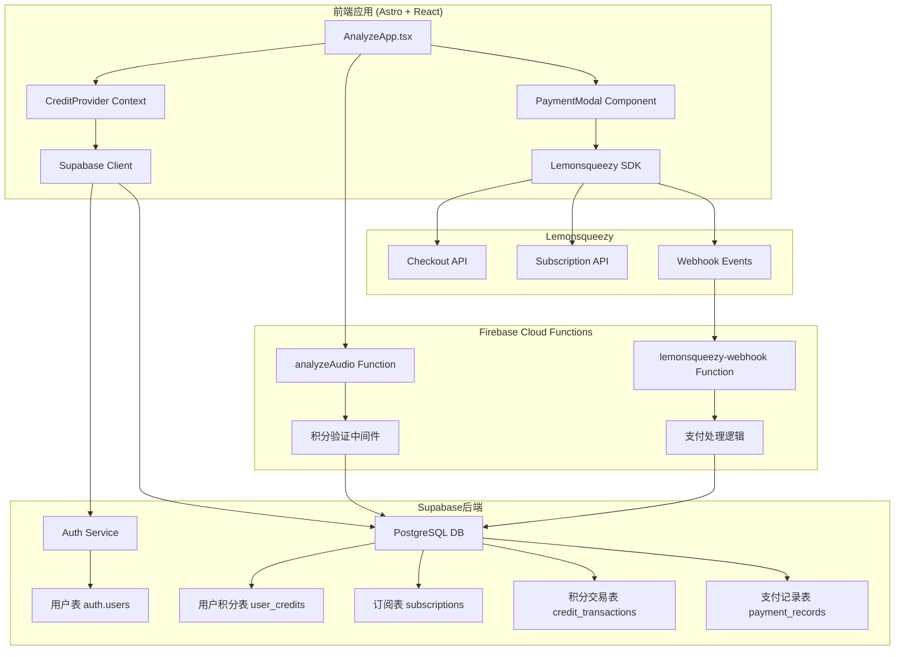

# 设计文档

## 概述

本设计文档描述了将现有使用次数限制系统升级为积分制系统，并集成Lemonsqueezy支付功能的技术实现方案。系统将基于音频时长计算积分消费（1秒=1积分），提供灵活的订阅套餐，并确保与现有架构的无缝集成。

## 架构

### 系统架构图



### 数据流

1. **积分消费流程**：
   - 用户上传音频 → 检测音频时长 → 计算所需积分 → 检查积分余额 → 执行分析 → 扣除积分 → 记录交易

2. **支付流程**：
   - 用户选择套餐 → 创建Lemonsqueezy checkout → 用户完成支付 → Webhook通知 → 验证支付 → 添加积分 → 更新订阅状态

3. **订阅管理流程**：
   - 创建订阅 → 定期检查状态 → 处理续费/取消 → 更新用户权益 → 发送通知

## 组件和接口

### 1. 积分系统核心组件

#### CreditProvider (React Context)
```typescript
interface CreditContextType {
  // 积分状态
  credits: number;
  loading: boolean;
  
  // 订阅状态
  subscription: Subscription | null;
  
  // 积分方法
  checkCredits: () => Promise<number>;
  consumeCredits: (amount: number, description: string) => Promise<void>;
  addCredits: (amount: number, source: string) => Promise<void>;
  
  // 支付方法
  createCheckout: (planId: string) => Promise<string>;
  getSubscriptionStatus: () => Promise<Subscription | null>;
  cancelSubscription: () => Promise<void>;
}

interface Subscription {
  id: string;
  status: 'active' | 'cancelled' | 'expired' | 'past_due';
  planId: string;
  planName: string;
  credits: number;
  currentPeriodStart: Date;
  currentPeriodEnd: Date;
  cancelAtPeriodEnd: boolean;
}
```

#### 音频时长检测服务
```typescript
class AudioDurationDetector {
  static async detectDuration(file: File): Promise<number>;
  static calculateCreditsRequired(durationSeconds: number): number;
  static formatDurationDisplay(seconds: number): string;
}
```

### 2. 支付集成组件

#### Lemonsqueezy集成服务
```typescript
class LemonsqueezyService {
  private apiKey: string;
  private storeId: string;
  
  // 创建结账会话
  async createCheckout(variantId: string, customData: any): Promise<CheckoutResponse>;
  
  // 获取订阅信息
  async getSubscription(subscriptionId: string): Promise<SubscriptionResponse>;
  
  // 取消订阅
  async cancelSubscription(subscriptionId: string): Promise<void>;
  
  // 验证webhook签名
  static verifyWebhookSignature(payload: string, signature: string, secret: string): boolean;
}

interface CheckoutResponse {
  data: {
    id: string;
    attributes: {
      url: string;
      expires_at: string;
    };
  };
}
```

#### PaymentModal组件
```typescript
interface PaymentModalProps {
  isOpen: boolean;
  onClose: () => void;
  currentCredits: number;
  onPaymentSuccess: (credits: number) => void;
}

const SUBSCRIPTION_PLANS = [
  { id: 'basic', price: 9.9, credits: 2000, variantId: 'variant_xxx' },
  { id: 'pro', price: 19.9, credits: 4000, variantId: 'variant_yyy' },
  { id: 'premium', price: 29.9, credits: 6000, variantId: 'variant_zzz' }
];
```

### 3. 现有组件修改

#### AnalyzeApp.tsx修改
```typescript
// 新增积分检查逻辑
const handleFiles = useCallback(async (files: FileList | null) => {
  if (!files || files.length === 0) return;
  
  const file = files[0];
  
  // 检测音频时长
  const duration = await AudioDurationDetector.detectDuration(file);
  const creditsRequired = AudioDurationDetector.calculateCreditsRequired(duration);
  
  // 检查积分余额
  const { credits } = useCredit();
  if (credits < creditsRequired) {
    setShowPaymentModal(true);
    return;
  }
  
  // 继续现有分析流程
  startAnalysis(file, creditsRequired);
}, []);
```

#### UploadSection.tsx修改
```typescript
// 新增积分显示组件
function CreditIndicator({ credits, estimatedCost }: { credits: number; estimatedCost?: number }) {
  return (
    <div className="glass-pane p-4 mb-6">
      <div className="flex items-center justify-between">
        <span className="text-slate-300">当前积分</span>
        <span className="text-green-400 font-semibold">{credits} 积分</span>
      </div>
      {estimatedCost && (
        <div className="flex items-center justify-between mt-2 text-sm">
          <span className="text-slate-400">预估消费</span>
          <span className="text-orange-400">{estimatedCost} 积分</span>
        </div>
      )}
    </div>
  );
}
```

## 数据模型

### Supabase数据库表结构

#### 1. 用户积分表 (user_credits)
```sql
CREATE TABLE user_credits (
  id UUID REFERENCES auth.users(id) PRIMARY KEY,
  credits INTEGER DEFAULT 0 NOT NULL,
  trial_credits INTEGER DEFAULT 100 NOT NULL, -- 试用积分
  monthly_credits INTEGER DEFAULT 200 NOT NULL, -- 月度赠送积分
  purchased_credits INTEGER DEFAULT 0 NOT NULL, -- 购买积分
  last_monthly_reset DATE DEFAULT CURRENT_DATE,
  created_at TIMESTAMP WITH TIME ZONE DEFAULT NOW(),
  updated_at TIMESTAMP WITH TIME ZONE DEFAULT NOW()
);

-- 触发器：自动更新updated_at
CREATE OR REPLACE FUNCTION update_updated_at_column()
RETURNS TRIGGER AS $$
BEGIN
    NEW.updated_at = NOW();
    RETURN NEW;
END;
$$ language 'plpgsql';

CREATE TRIGGER update_user_credits_updated_at 
  BEFORE UPDATE ON user_credits 
  FOR EACH ROW EXECUTE FUNCTION update_updated_at_column();
```

#### 2. 订阅表 (subscriptions)
```sql
CREATE TABLE subscriptions (
  id UUID DEFAULT gen_random_uuid() PRIMARY KEY,
  user_id UUID REFERENCES auth.users(id) NOT NULL,
  lemonsqueezy_subscription_id TEXT UNIQUE NOT NULL,
  lemonsqueezy_variant_id TEXT NOT NULL,
  status TEXT NOT NULL CHECK (status IN ('active', 'cancelled', 'expired', 'past_due')),
  plan_name TEXT NOT NULL,
  plan_credits INTEGER NOT NULL,
  current_period_start TIMESTAMP WITH TIME ZONE NOT NULL,
  current_period_end TIMESTAMP WITH TIME ZONE NOT NULL,
  cancel_at_period_end BOOLEAN DEFAULT FALSE,
  created_at TIMESTAMP WITH TIME ZONE DEFAULT NOW(),
  updated_at TIMESTAMP WITH TIME ZONE DEFAULT NOW(),
  
  -- 索引
  CONSTRAINT unique_active_subscription_per_user 
    EXCLUDE (user_id WITH =) WHERE (status = 'active')
);

CREATE INDEX idx_subscriptions_user_id ON subscriptions(user_id);
CREATE INDEX idx_subscriptions_status ON subscriptions(status);
CREATE INDEX idx_subscriptions_lemonsqueezy_id ON subscriptions(lemonsqueezy_subscription_id);
```

#### 3. 积分交易表 (credit_transactions)
```sql
CREATE TABLE credit_transactions (
  id UUID DEFAULT gen_random_uuid() PRIMARY KEY,
  user_id UUID REFERENCES auth.users(id) NOT NULL,
  device_fingerprint_id UUID REFERENCES device_fingerprints(id) NULL, -- 试用用户
  transaction_type TEXT NOT NULL CHECK (transaction_type IN ('consume', 'add', 'refund')),
  amount INTEGER NOT NULL, -- 正数为增加，负数为消费
  balance_after INTEGER NOT NULL,
  source TEXT NOT NULL, -- 'analysis', 'purchase', 'monthly_grant', 'trial_grant', 'refund'
  description TEXT,
  metadata JSONB DEFAULT '{}',
  analysis_id TEXT NULL, -- 关联分析记录
  payment_id UUID NULL, -- 关联支付记录
  created_at TIMESTAMP WITH TIME ZONE DEFAULT NOW()
);

CREATE INDEX idx_credit_transactions_user_id ON credit_transactions(user_id);
CREATE INDEX idx_credit_transactions_created_at ON credit_transactions(created_at);
CREATE INDEX idx_credit_transactions_type ON credit_transactions(transaction_type);
```

#### 4. 支付记录表 (payment_records)
```sql
CREATE TABLE payment_records (
  id UUID DEFAULT gen_random_uuid() PRIMARY KEY,
  user_id UUID REFERENCES auth.users(id) NOT NULL,
  lemonsqueezy_order_id TEXT UNIQUE NOT NULL,
  lemonsqueezy_subscription_id TEXT NULL,
  amount_usd DECIMAL(10,2) NOT NULL,
  credits_purchased INTEGER NOT NULL,
  status TEXT NOT NULL CHECK (status IN ('pending', 'completed', 'failed', 'refunded')),
  payment_method TEXT,
  webhook_data JSONB,
  processed_at TIMESTAMP WITH TIME ZONE,
  created_at TIMESTAMP WITH TIME ZONE DEFAULT NOW()
);

CREATE INDEX idx_payment_records_user_id ON payment_records(user_id);
CREATE INDEX idx_payment_records_status ON payment_records(status);
CREATE INDEX idx_payment_records_lemonsqueezy_order ON payment_records(lemonsqueezy_order_id);
```

#### 5. 设备试用积分表 (device_trial_credits) - 扩展现有device_fingerprints
```sql
-- 扩展现有device_fingerprints表
ALTER TABLE device_fingerprints 
ADD COLUMN trial_credits INTEGER DEFAULT 100,
ADD COLUMN credits_used INTEGER DEFAULT 0;

-- 更新现有记录
UPDATE device_fingerprints 
SET trial_credits = 100 - trial_usage, credits_used = trial_usage * 180
WHERE trial_usage > 0;
```

### 数据库函数和存储过程

#### 1. 积分消费函数
```sql
CREATE OR REPLACE FUNCTION consume_credits(
  user_uuid UUID,
  credits_amount INTEGER,
  analysis_description TEXT,
  analysis_id TEXT DEFAULT NULL
) RETURNS BOOLEAN AS $$
DECLARE
  current_credits INTEGER;
  new_balance INTEGER;
BEGIN
  -- 获取当前积分余额
  SELECT credits INTO current_credits 
  FROM user_credits 
  WHERE id = user_uuid;
  
  -- 检查积分是否足够
  IF current_credits < credits_amount THEN
    RETURN FALSE;
  END IF;
  
  -- 计算新余额
  new_balance := current_credits - credits_amount;
  
  -- 更新用户积分
  UPDATE user_credits 
  SET credits = new_balance, updated_at = NOW()
  WHERE id = user_uuid;
  
  -- 记录交易
  INSERT INTO credit_transactions (
    user_id, transaction_type, amount, balance_after, 
    source, description, analysis_id
  ) VALUES (
    user_uuid, 'consume', -credits_amount, new_balance,
    'analysis', analysis_description, analysis_id
  );
  
  RETURN TRUE;
END;
$$ LANGUAGE plpgsql;
```

#### 2. 积分添加函数
```sql
CREATE OR REPLACE FUNCTION add_credits(
  user_uuid UUID,
  credits_amount INTEGER,
  credit_source TEXT,
  description TEXT DEFAULT NULL,
  payment_record_id UUID DEFAULT NULL
) RETURNS BOOLEAN AS $$
DECLARE
  current_credits INTEGER;
  new_balance INTEGER;
BEGIN
  -- 获取当前积分余额
  SELECT credits INTO current_credits 
  FROM user_credits 
  WHERE id = user_uuid;
  
  -- 如果用户记录不存在，创建一个
  IF current_credits IS NULL THEN
    INSERT INTO user_credits (id, credits) 
    VALUES (user_uuid, credits_amount);
    new_balance := credits_amount;
  ELSE
    -- 计算新余额
    new_balance := current_credits + credits_amount;
    
    -- 更新用户积分
    UPDATE user_credits 
    SET credits = new_balance, updated_at = NOW()
    WHERE id = user_uuid;
  END IF;
  
  -- 记录交易
  INSERT INTO credit_transactions (
    user_id, transaction_type, amount, balance_after, 
    source, description, payment_id
  ) VALUES (
    user_uuid, 'add', credits_amount, new_balance,
    credit_source, description, payment_record_id
  );
  
  RETURN TRUE;
END;
$$ LANGUAGE plpgsql;
```

#### 3. 月度积分重置函数
```sql
CREATE OR REPLACE FUNCTION reset_monthly_credits() RETURNS INTEGER AS $$
DECLARE
  reset_count INTEGER := 0;
  user_record RECORD;
BEGIN
  -- 为所有需要重置的用户添加月度积分
  FOR user_record IN 
    SELECT id FROM user_credits 
    WHERE last_monthly_reset < CURRENT_DATE
  LOOP
    -- 添加月度积分
    PERFORM add_credits(
      user_record.id, 
      200, 
      'monthly_grant', 
      'Monthly credit grant'
    );
    
    -- 更新重置日期
    UPDATE user_credits 
    SET last_monthly_reset = CURRENT_DATE
    WHERE id = user_record.id;
    
    reset_count := reset_count + 1;
  END LOOP;
  
  RETURN reset_count;
END;
$$ LANGUAGE plpgsql;
```

## 错误处理

### 错误类型定义
```typescript
enum CreditErrorType {
  INSUFFICIENT_CREDITS = 'INSUFFICIENT_CREDITS',
  INVALID_AMOUNT = 'INVALID_AMOUNT',
  TRANSACTION_FAILED = 'TRANSACTION_FAILED',
  PAYMENT_FAILED = 'PAYMENT_FAILED',
  SUBSCRIPTION_ERROR = 'SUBSCRIPTION_ERROR'
}

enum PaymentErrorType {
  LEMONSQUEEZY_ERROR = 'LEMONSQUEEZY_ERROR',
  WEBHOOK_VERIFICATION_FAILED = 'WEBHOOK_VERIFICATION_FAILED',
  DUPLICATE_PAYMENT = 'DUPLICATE_PAYMENT',
  INVALID_SUBSCRIPTION = 'INVALID_SUBSCRIPTION'
}
```

### 错误处理策略
1. **积分不足**：显示购买选项和当前余额
2. **支付失败**：提供重试选项和客服联系方式
3. **网络错误**：自动重试机制和离线提示
4. **数据不一致**：事务回滚和数据修复

## 测试策略

### 单元测试
- 积分计算逻辑测试
- 音频时长检测测试
- 支付流程测试
- 数据库函数测试

### 集成测试
- Lemonsqueezy API集成测试
- Webhook处理测试
- 完整支付流程测试
- 订阅管理测试

### 端到端测试
- 用户完整购买流程
- 积分消费和补充流程
- 订阅续费和取消流程
- 数据迁移测试

## 安全考虑

### 1. 支付安全
- Webhook签名验证
- 重复支付检测
- 敏感数据加密
- PCI DSS合规

### 2. 积分安全
- 防止积分篡改
- 交易原子性保证
- 审计日志记录
- 异常检测机制

### 3. API安全
- 请求签名验证
- 速率限制
- 输入验证
- 错误信息脱敏

## 性能优化

### 1. 数据库优化
- 索引优化
- 查询优化
- 连接池管理
- 读写分离

### 2. 缓存策略
- 用户积分缓存
- 订阅状态缓存
- 支付状态缓存
- CDN静态资源

### 3. 异步处理
- Webhook异步处理
- 积分计算异步化
- 邮件通知异步发送
- 数据分析异步处理

## 部署和监控

### 环境配置
```typescript
interface LemonsqueezyConfig {
  apiKey: string;
  storeId: string;
  webhookSecret: string;
  variantIds: {
    basic: string;
    pro: string;
    premium: string;
  };
}

interface CreditSystemConfig {
  trialCredits: number;
  monthlyCredits: number;
  creditsPerSecond: number;
  maxFileSize: number;
}
```

### 监控指标
- 积分消费率
- 支付成功率
- 订阅转换率
- 系统响应时间
- 错误率统计

### 告警设置
- 支付失败告警
- 积分异常告警
- Webhook失败告警
- 系统性能告警

## 迁移策略

### 数据迁移计划
1. **阶段1**：创建新的积分系统表结构
2. **阶段2**：迁移现有用户数据到积分制
3. **阶段3**：部署新的前端界面
4. **阶段4**：切换到积分制计费
5. **阶段5**：清理旧的次数制代码

### 迁移脚本
```sql
-- 迁移现有试用用户
INSERT INTO credit_transactions (
  device_fingerprint_id, transaction_type, amount, balance_after,
  source, description
)
SELECT 
  id, 'add', (5 - trial_usage) * 180, (5 - trial_usage) * 180,
  'migration', 'Migrated from trial usage system'
FROM device_fingerprints 
WHERE trial_usage < 5;

-- 迁移现有注册用户
INSERT INTO user_credits (id, credits, monthly_credits)
SELECT 
  id, 
  GREATEST(0, (10 - current_month_usage) * 180 + 200), -- 剩余次数转积分 + 当月积分
  200
FROM user_profiles;
```

## 技术栈

### 新增依赖
```json
{
  "dependencies": {
    "@lemonsqueezy/lemonsqueezy.js": "^3.0.0",
    "crypto": "^1.0.1",
    "date-fns": "^2.30.0"
  }
}
```

### API集成
- **Lemonsqueezy API**: 支付处理和订阅管理
- **Supabase**: 数据存储和用户管理
- **Firebase Cloud Functions**: Webhook处理和业务逻辑

### 开发工具
- **TypeScript**: 类型安全
- **React Hook Form**: 表单管理
- **Zod**: 数据验证
- **Jest**: 单元测试
- **Cypress**: 端到端测试