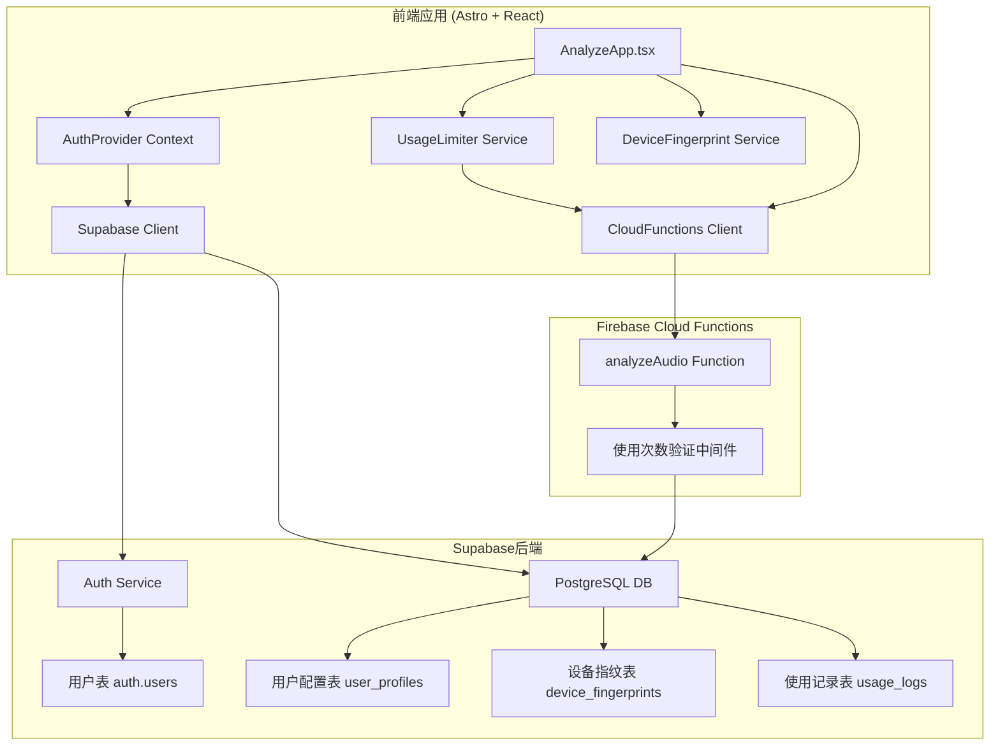

# 设计文档

## 概述

本设计文档描述了为现有音频分析应用添加用户认证系统和使用限制功能的技术实现方案。基于现有的Astro + React + Firebase Cloud Functions架构，集成Supabase作为认证和用户数据后端，实现用户注册、登录、会话管理，并通过设备指纹技术管理未注册用户的试用次数限制。

## 架构

### 现有系统架构分析

当前系统包含：
- **前端**: Astro + React (TypeScript)
- **主要组件**: AnalyzeApp.tsx (主应用), UploadSection.tsx (上传), DashboardSection.tsx (结果展示)
- **云函数**: Firebase Cloud Functions (analyzeAudio.ts)
- **存储**: 本地存储 (historyStorage.ts) + Google Cloud Storage
- **API客户端**: cloudFunctions.ts

### 集成认证系统架构图



### 数据流

1. **未注册用户流程**：
   - 用户访问 `/analyze` → AuthProvider检查认证状态 → 生成设备指纹 → 查询Supabase试用次数 → UploadSection显示剩余次数 → 用户上传文件 → cloudFunctions.analyzeAudio() → 云函数验证设备指纹使用次数 → 执行分析 → 更新试用计数
   
2. **注册用户流程**：
   - 用户登录 → Supabase JWT验证 → AuthProvider更新用户状态 → 查询月度使用次数 → UploadSection显示用户信息和剩余次数 → 用户上传文件 → cloudFunctions.analyzeAudio() → 云函数验证JWT和用户使用次数 → 执行分析 → 更新月度计数

3. **现有组件集成流程**：
   - AnalyzeApp.tsx → 包装AuthProvider → 传递认证状态到子组件 → UploadSection/DashboardSection根据认证状态调整UI → historyStorage.ts关联用户ID存储历史记录

## 组件和接口

### 1. 认证组件 (基于现有架构)

#### AuthProvider (React Context)
```typescript
interface AuthContextType {
  user: User | null;
  session: Session | null;
  loading: boolean;
  usageStatus: UsageStatus | null;
  signUp: (email: string, password: string) => Promise<AuthResponse>;
  signIn: (email: string, password: string) => Promise<AuthResponse>;
  signOut: () => Promise<void>;
  resetPassword: (email: string) => Promise<void>;
  checkUsageLimit: () => Promise<UsageStatus>;
  consumeUsage: () => Promise<void>;
}

interface UsageStatus {
  allowed: boolean;
  remaining: number;
  total: number;
  resetDate?: Date;
  requiresAuth: boolean;
  userType: 'trial' | 'registered';
}
```

#### 现有组件修改

**AnalyzeApp.tsx 修改**：
- 包装AuthProvider Context
- 在startAnalysis()前检查使用限制
- 根据认证状态调整UI显示

**UploadSection.tsx 修改**：
- 添加使用次数显示组件
- 试用用户显示"剩余X次免费试用"
- 注册用户显示"本月剩余X次"
- 达到限制时显示登录/升级提示

**Header.astro 修改**：
- 添加用户头像/登录按钮
- 集成登录模态框

### 2. 设备指纹服务 (新增)

#### DeviceFingerprint 类
```typescript
class DeviceFingerprint {
  static async generate(): Promise<string>;
  static async getTrialUsage(fingerprint: string): Promise<number>;
  static async updateTrialUsage(fingerprint: string): Promise<void>;
  static async clearTrialData(fingerprint: string): Promise<void>;
  static async associateWithUser(fingerprint: string, userId: string): Promise<void>;
}
```

#### 指纹生成算法 (集成到现有cloudFunctions.ts)
```typescript
// 新增到 src/utils/deviceFingerprint.ts
export class DeviceFingerprint {
  private static async generateFingerprint(): Promise<string> {
    const components = [
      screen.width + 'x' + screen.height,
      screen.colorDepth,
      Intl.DateTimeFormat().resolvedOptions().timeZone,
      navigator.language,
      navigator.platform,
      this.getCanvasFingerprint(),
      this.getWebGLFingerprint()
    ];
    
    const fingerprint = components.join('|');
    return await this.hashFingerprint(fingerprint);
  }
}
```

### 3. 使用限制服务 (集成到cloudFunctions.ts)

#### 修改现有 CloudFunctionsClient
```typescript
// 扩展现有的 cloudFunctions.ts
export class CloudFunctionsClient {
  // 现有方法保持不变...
  
  // 新增认证相关方法
  async checkUsageLimit(authToken?: string, deviceFingerprint?: string): Promise<UsageStatus>;
  async analyzeAudioWithAuth(
    audioFile: File, 
    options: AnalysisOptions & { authToken?: string; deviceFingerprint?: string }
  ): Promise<CloudAnalysisResult>;
}

// 修改现有的 analyzeAudio 方法
async analyzeAudio(audioFile: File, options: AnalysisOptions = {}): Promise<CloudAnalysisResult> {
  // 1. 获取认证状态和设备指纹
  const authContext = useAuth(); // 从Context获取
  const deviceFingerprint = await DeviceFingerprint.generate();
  
  // 2. 检查使用限制
  const usageStatus = await this.checkUsageLimit(authContext.session?.access_token, deviceFingerprint);
  if (!usageStatus.allowed) {
    throw new CloudFunctionsError('USAGE_LIMIT_EXCEEDED', usageStatus.message);
  }
  
  // 3. 执行现有分析逻辑...
}
```

### 4. UI集成组件 (基于现有组件修改)

#### UsageIndicator 组件 (新增到UploadSection.tsx)
```typescript
function UsageIndicator({ usageStatus }: { usageStatus: UsageStatus }) {
  if (usageStatus.userType === 'trial') {
    return (
      <div className="glass-pane p-4 mb-6">
        <div className="flex items-center justify-between">
          <span className="text-slate-300">免费试用</span>
          <span className="text-violet-400 font-semibold">
            剩余 {usageStatus.remaining}/5 次
          </span>
        </div>
        {usageStatus.remaining <= 2 && (
          <p className="text-orange-400 text-sm mt-2">
            试用次数即将用完，<button className="underline">注册账户</button>获得每月10次分析机会
          </p>
        )}
      </div>
    );
  }
  
  return (
    <div className="glass-pane p-4 mb-6">
      <div className="flex items-center justify-between">
        <span className="text-slate-300">本月使用情况</span>
        <span className="text-green-400 font-semibold">
          剩余 {usageStatus.remaining}/{usageStatus.total} 次
        </span>
      </div>
    </div>
  );
}
```

#### 现有组件修改策略
- **UploadSection.tsx**: 添加UsageIndicator，限制时禁用上传
- **DashboardSection.tsx**: 显示用户信息，历史记录关联用户
- **HistorySidebar.tsx**: 根据用户状态过滤历史记录
- **Header.astro**: 添加登录/用户菜单

## 数据模型

### Supabase数据库表结构

#### 1. 用户表 (auth.users)
Supabase内置用户表，包含：
- id (UUID)
- email
- created_at
- updated_at
- email_confirmed_at

#### 2. 用户配置表 (user_profiles)
```sql
CREATE TABLE user_profiles (
  id UUID REFERENCES auth.users(id) PRIMARY KEY,
  created_at TIMESTAMP WITH TIME ZONE DEFAULT NOW(),
  updated_at TIMESTAMP WITH TIME ZONE DEFAULT NOW(),
  monthly_limit INTEGER DEFAULT 10,
  current_month_usage INTEGER DEFAULT 0,
  last_reset_date DATE DEFAULT CURRENT_DATE
);
```

#### 3. 设备指纹表 (device_fingerprints)
```sql
CREATE TABLE device_fingerprints (
  id UUID DEFAULT gen_random_uuid() PRIMARY KEY,
  fingerprint_hash TEXT UNIQUE NOT NULL,
  trial_usage INTEGER DEFAULT 0,
  created_at TIMESTAMP WITH TIME ZONE DEFAULT NOW(),
  last_used_at TIMESTAMP WITH TIME ZONE DEFAULT NOW(),
  user_id UUID REFERENCES auth.users(id) NULL, -- 关联到用户（注册后）
  metadata JSONB DEFAULT '{}' -- 存储设备信息（已哈希）
);

-- 索引优化
CREATE INDEX idx_device_fingerprints_hash ON device_fingerprints(fingerprint_hash);
CREATE INDEX idx_device_fingerprints_user_id ON device_fingerprints(user_id);
```

#### 4. 使用记录表 (usage_logs)
```sql
CREATE TABLE usage_logs (
  id UUID DEFAULT gen_random_uuid() PRIMARY KEY,
  user_id UUID REFERENCES auth.users(id) NULL,
  device_fingerprint_id UUID REFERENCES device_fingerprints(id) NULL,
  analysis_type TEXT NOT NULL DEFAULT 'audio_analysis',
  created_at TIMESTAMP WITH TIME ZONE DEFAULT NOW(),
  file_name TEXT,
  file_size BIGINT,
  processing_time INTEGER,
  success BOOLEAN DEFAULT TRUE,
  error_message TEXT NULL,
  -- 与现有历史记录系统集成
  analysis_result_id TEXT NULL -- 对应 HistoryRecord.id
);

-- 索引优化
CREATE INDEX idx_usage_logs_user_id ON usage_logs(user_id);
CREATE INDEX idx_usage_logs_created_at ON usage_logs(created_at);
CREATE INDEX idx_usage_logs_device_fingerprint ON usage_logs(device_fingerprint_id);
```

### 数据库策略和安全

#### Row Level Security (RLS) 策略
```sql
-- 用户只能访问自己的配置
ALTER TABLE user_profiles ENABLE ROW LEVEL SECURITY;
CREATE POLICY "Users can view own profile" ON user_profiles
  FOR SELECT USING (auth.uid() = id);

-- 用户只能查看自己的使用记录
ALTER TABLE usage_logs ENABLE ROW LEVEL SECURITY;
CREATE POLICY "Users can view own usage" ON usage_logs
  FOR SELECT USING (auth.uid() = user_id);
```

## 错误处理

### 错误类型定义
```typescript
enum AuthErrorType {
  INVALID_CREDENTIALS = 'INVALID_CREDENTIALS',
  EMAIL_NOT_CONFIRMED = 'EMAIL_NOT_CONFIRMED',
  WEAK_PASSWORD = 'WEAK_PASSWORD',
  EMAIL_ALREADY_EXISTS = 'EMAIL_ALREADY_EXISTS',
  NETWORK_ERROR = 'NETWORK_ERROR',
  SESSION_EXPIRED = 'SESSION_EXPIRED'
}

enum UsageErrorType {
  TRIAL_LIMIT_EXCEEDED = 'TRIAL_LIMIT_EXCEEDED',
  MONTHLY_LIMIT_EXCEEDED = 'MONTHLY_LIMIT_EXCEEDED',
  DEVICE_FINGERPRINT_ERROR = 'DEVICE_FINGERPRINT_ERROR',
  DATABASE_ERROR = 'DATABASE_ERROR'
}
```

### 错误处理策略
1. **网络错误**：显示重试选项和离线提示
2. **认证错误**：清晰的错误信息和解决建议
3. **使用限制错误**：引导用户注册或等待重置
4. **设备指纹错误**：降级到基本限制模式

## 测试策略

### 单元测试
- 设备指纹生成算法测试
- 使用限制逻辑测试
- 认证流程测试
- 数据库操作测试

### 集成测试
- 完整的用户注册流程
- 试用到注册的转换流程
- 月度重置功能测试
- 跨设备会话管理测试

### 端到端测试
- 用户完整使用流程
- 不同浏览器的兼容性测试
- 移动设备响应式测试
- 错误场景处理测试

## 安全考虑

### 1. 设备指纹安全
- 使用SHA-256哈希存储指纹
- 不存储可逆的设备信息
- 定期清理过期的指纹记录

### 2. 认证安全
- 使用Supabase的JWT令牌
- 实施会话超时机制
- 密码强度验证
- 邮箱验证要求

### 3. API安全
- 所有API调用都需要验证
- 实施速率限制
- 输入验证和清理
- CORS配置

### 4. 数据保护
- 最小化数据收集
- 遵循GDPR要求
- 数据加密传输
- 定期数据清理

## 性能优化

### 1. 前端优化
- 懒加载认证组件
- 缓存用户状态
- 优化设备指纹生成
- 减少不必要的API调用

### 2. 后端优化
- 数据库索引优化
- 查询性能优化
- 连接池管理
- 缓存策略

### 3. 用户体验优化
- 快速的认证状态检查
- 平滑的加载状态
- 离线功能支持
- 错误恢复机制

## 部署和监控

### 环境配置
```typescript
interface SupabaseConfig {
  url: string;
  anonKey: string;
  serviceRoleKey?: string; // 仅服务端使用
}

interface AppConfig {
  supabase: SupabaseConfig;
  trialLimit: number;
  monthlyLimit: number;
  fingerprintSalt: string;
}
```

### 监控指标
- 用户注册转换率
- 试用使用率
- 认证成功率
- API响应时间
- 错误率统计

### 日志记录
- 用户行为日志
- 错误日志
- 性能日志
- 安全事件日志

## 云函数集成策略

### 现有analyzeAudio函数修改
```typescript
// cloud-functions/src/functions/analyzeAudio.ts 修改
export const analyzeAudio = functions
  .region('us-central1')
  .https
  .onRequest(async (req: Request, res: Response) => {
    // 1. 现有CORS和请求验证保持不变
    
    // 2. 新增：认证和使用限制检查
    const authToken = req.headers.authorization?.replace('Bearer ', '');
    const deviceFingerprint = req.headers['x-device-fingerprint'] as string;
    
    // 3. 验证使用限制
    const usageCheck = await verifyUsageLimit(authToken, deviceFingerprint, requestId);
    if (!usageCheck.allowed) {
      return res.status(429).json({
        success: false,
        error: {
          code: 'USAGE_LIMIT_EXCEEDED',
          message: usageCheck.message
        }
      });
    }
    
    // 4. 现有文件处理和分析逻辑保持不变
    const audioFile = await processFileUploadWithFallback(req, requestId);
    const analysisResult = await performAnalysis(audioFile, {}, requestId);
    
    // 5. 新增：记录使用并更新计数
    await recordUsage(usageCheck.userId, usageCheck.deviceFingerprintId, analysisResult, requestId);
    
    // 6. 返回结果（现有逻辑）
    res.status(200).json({ success: true, data: analysisResult });
  });

// 新增使用限制验证函数
async function verifyUsageLimit(authToken?: string, deviceFingerprint?: string, requestId?: string) {
  // 连接Supabase并验证使用限制
  // 返回验证结果和用户/设备信息
}
```

### Supabase集成到云函数
```typescript
// cloud-functions/src/services/supabaseService.ts (新增)
import { createClient } from '@supabase/supabase-js';

export class SupabaseService {
  private client = createClient(
    process.env.SUPABASE_URL!,
    process.env.SUPABASE_SERVICE_ROLE_KEY! // 服务端密钥
  );
  
  async verifyUserUsage(authToken: string): Promise<UsageVerification>;
  async verifyDeviceUsage(fingerprint: string): Promise<UsageVerification>;
  async recordUsage(userId?: string, deviceId?: string, analysisData?: any): Promise<void>;
}
```

## 迁移策略

### 现有系统兼容性
- **历史记录**: 现有historyStorage.ts保持本地存储，新增用户关联
- **API接口**: cloudFunctions.ts保持现有接口，内部添加认证逻辑
- **UI组件**: 现有组件渐进式增强，不破坏现有功能
- **用户体验**: 未登录用户仍可使用（试用模式），无缝过渡

### 渐进式部署
1. **阶段1**: 添加Supabase基础设施和数据库表
2. **阶段2**: 修改云函数添加使用限制验证
3. **阶段3**: 前端添加认证UI和使用限制显示
4. **阶段4**: 集成历史记录用户关联和优化

## 技术栈

### 现有技术栈保持
- **前端框架**: Astro + React + TypeScript
- **样式**: Tailwind CSS
- **云函数**: Firebase Cloud Functions
- **存储**: Google Cloud Storage
- **构建工具**: Astro构建系统

### 新增依赖
```json
{
  "dependencies": {
    "@supabase/supabase-js": "^2.39.0",
    "react-hook-form": "^7.48.2", 
    "zod": "^3.22.4",
    "js-sha256": "^0.10.1"
  }
}
```

### 后端服务集成
- **Supabase**: 认证和用户数据存储
- **Firebase Cloud Functions**: 保持现有音频分析逻辑
- **PostgreSQL (Supabase)**: 用户配置和使用记录
- **Google Cloud Storage**: 保持现有文件存储

### 开发和测试
- **TypeScript**: 现有类型安全
- **现有测试框架**: 保持当前测试设置
- **环境配置**: 添加Supabase配置到现有环境变量