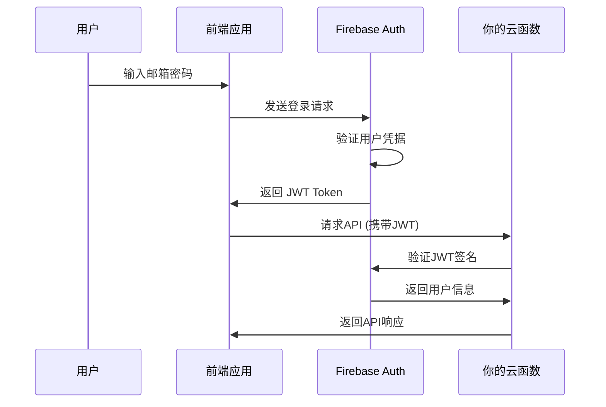

# JWT 验证原理详解

## 1. 用户登录流程



## 2. JWT 验证的安全原理

### 为什么JWT安全？

1. **数字签名**：使用Firebase的私钥签名，无法伪造
2. **时效性**：有过期时间，通常1小时
3. **完整性**：任何篡改都会导致签名验证失败
4. **无状态**：服务器不需要存储session

### 验证步骤

1. **解析Token**：分离Header、Payload、Signature
2. **验证格式**：检查是否符合JWT标准
3. **验证签名**：使用Firebase公钥验证签名
4. **验证时间**：检查是否过期
5. **验证受众**：确认是发给你的项目的
6. **提取信息**：获取用户ID等信息

## 3. 为什么之前的实现不安全？

```typescript
// ❌ 不安全的实现（之前）
if (authHeader && authHeader.startsWith('Bearer ')) {
    // 只检查格式，不验证内容！
    userId = req.get('X-User-ID'); // 可以随意伪造
}

// ✅ 安全的实现（现在）
if (authHeader && authHeader.startsWith('Bearer ')) {
    const token = authHeader.substring(7);
    const decodedToken = await admin.auth().verifyIdToken(token);
    userId = decodedToken.uid; // 从验证过的token中获取
}
```

## 4. 攻击者无法绕过的原因

1. **无法伪造签名**：没有Firebase私钥
2. **无法重放攻击**：Token有过期时间
3. **无法篡改内容**：任何修改都会破坏签名
4. **无法暴力破解**：RSA-256加密强度极高

## 5. Firebase JWT的特殊之处

- **自动轮换密钥**：Firebase定期更换签名密钥
- **多重验证**：验证签发者、受众、时间等多个字段
- **标准兼容**：符合RFC 7519标准
- **高性能**：验证过程很快，适合高并发