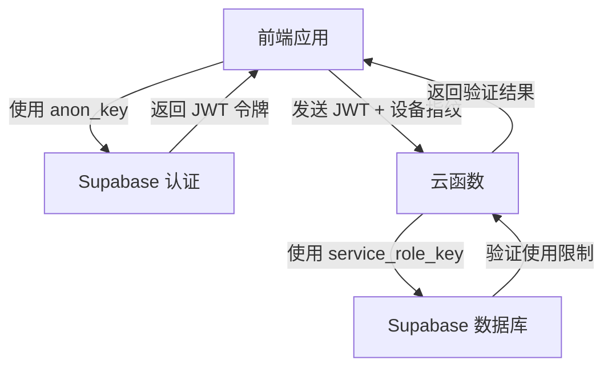

# Supabase 密钥使用指南

## 🔑 密钥类型说明

Supabase 提供两种主要的 API 密钥，用途不同：

### 1. Anonymous Key (anon key)
- **用途**: 前端客户端认证
- **权限**: 受 Row Level Security (RLS) 策略限制
- **安全性**: 可以暴露在前端代码中
- **使用场景**: 用户注册、登录、查询自己的数据

### 2. Service Role Key (service_role key)
- **用途**: 服务端操作
- **权限**: 绕过 RLS，拥有完全数据库访问权限
- **安全性**: 绝对不能暴露在前端，仅用于服务端
- **使用场景**: 云函数、服务端 API、管理操作

## 📁 配置文件说明

### 前端配置 (项目根目录 `.env`)
```env
# 前端需要两个密钥
VITE_SUPABASE_URL=https://your-project-id.supabase.co
VITE_SUPABASE_ANON_KEY=eyJhbGciOiJIUzI1NiIsInR5cCI6IkpXVCJ9...  # 用于前端认证
SUPABASE_SERVICE_ROLE_KEY=eyJhbGciOiJIUzI1NiIsInR5cCI6IkpXVCJ9...  # 用于云函数调用
```

**为什么前端需要 service_role_key？**
- 前端不直接使用它
- 它会被传递给云函数使用
- 云函数需要它来验证使用限制和记录使用情况

### 云函数配置 (`cloud-functions/.env`)
```env
# 云函数只需要 service_role_key
SUPABASE_URL=https://your-project-id.supabase.co
SUPABASE_SERVICE_ROLE_KEY=eyJhbGciOiJIUzI1NiIsInR5cCI6IkpXVCJ9...  # 用于服务端操作
```

**为什么云函数不需要 anon_key？**
- 云函数运行在服务端，不需要用户级别的认证
- 云函数使用 service_role_key 直接操作数据库
- 云函数负责验证前端传来的用户 JWT 令牌

## 🔒 安全最佳实践

### ✅ 正确做法
- `anon_key` 可以在前端代码中使用
- `service_role_key` 只在服务端环境中使用
- 使用环境变量存储密钥，不要硬编码
- 在生产环境中使用不同的密钥

### ❌ 错误做法
- 不要在前端直接使用 `service_role_key`
- 不要将 `service_role_key` 提交到版本控制
- 不要在客户端 JavaScript 中暴露 `service_role_key`

## 🛠️ 获取密钥

1. 登录 [Supabase 控制台](https://supabase.com/dashboard)
2. 选择你的项目
3. 进入 **Settings** > **API**
4. 复制以下密钥：
   - **Project URL**: `https://your-project-id.supabase.co`
   - **anon public**: 这是你的 `anon_key`
   - **service_role secret**: 这是你的 `service_role_key`

## 🔄 密钥在系统中的流转



## 📋 配置检查清单

### 前端配置检查
- [ ] `VITE_SUPABASE_URL` 已设置
- [ ] `VITE_SUPABASE_ANON_KEY` 已设置（用于用户认证）
- [ ] `SUPABASE_SERVICE_ROLE_KEY` 已设置（传递给云函数）

### 云函数配置检查
- [ ] `SUPABASE_URL` 已设置
- [ ] `SUPABASE_SERVICE_ROLE_KEY` 已设置（用于数据库操作）
- [ ] ❌ 不需要设置 `anon_key`

## 🐛 常见问题

**Q: 为什么前端需要 service_role_key？**
A: 前端不直接使用它，而是将它传递给云函数。云函数需要它来执行管理员级别的操作，如验证使用限制。

**Q: 云函数为什么不需要 anon_key？**
A: 云函数运行在服务端，使用 service_role_key 可以直接操作数据库，不需要通过用户级别的认证。

**Q: 如何确保 service_role_key 的安全？**
A: 
- 只在服务端环境中使用
- 使用环境变量而不是硬编码
- 不要提交到版本控制系统
- 定期轮换密钥

**Q: 可以在前端直接使用 service_role_key 吗？**
A: 绝对不可以！这会给攻击者完全的数据库访问权限。

## 🎯 总结

- **前端**: 使用 `anon_key` 进行用户认证，存储 `service_role_key` 传递给云函数
- **云函数**: 只使用 `service_role_key` 进行数据库操作
- **安全**: `service_role_key` 绝不暴露在前端，只在服务端使用

这样的设计确保了安全性和功能性的平衡。